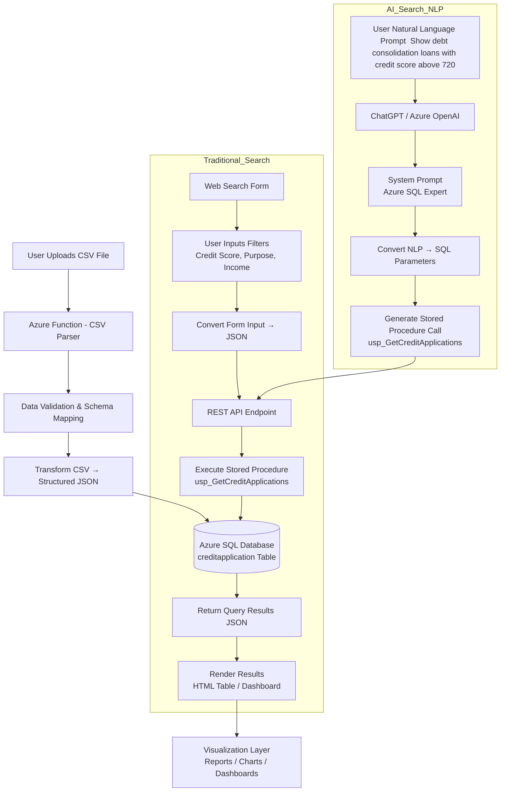
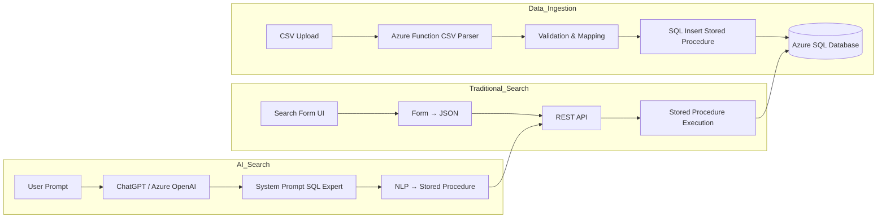
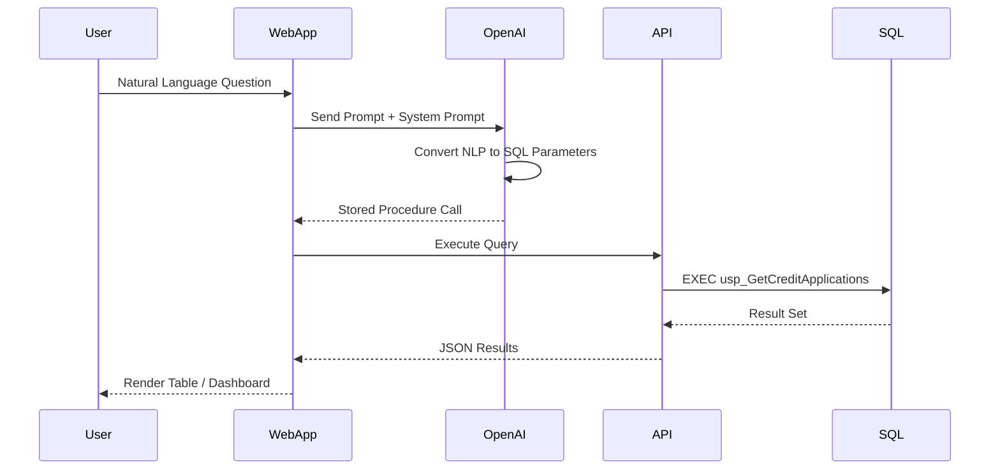

# Credit Application Service

## 📘 Use Case: Bulk Loan Application Ingestion + AI-Powered Natural Language Reporting on Azure

---

# 🔥 Executive Summary

Fringe Financial Services is modernizing its loan data platform by introducing a scalable **Azure-based ingestion and intelligent search architecture** while preserving existing operational systems. Loan application records will be **bulk uploaded via an Azure Function**, where CSV or structured files are validated, transformed, and securely inserted into **Azure SQL Database** using the organization’s existing stored procedures. This approach ensures seamless integration with current data models and minimizes disruption to established processes.

End users will continue to leverage the **traditional search interface** to retrieve loan information using familiar filters and queries, maintaining compatibility with the existing application workflows and stored procedures already optimized for performance and reporting.

To enhance accessibility and analytics capabilities, the platform will introduce an **AI-powered Natural Language Processing (NLP) layer** that allows users to interact with the system using **voice or conversational chat**. Through integration with **Azure OpenAI**, user prompts will be interpreted and translated into structured stored procedure calls, enabling natural language questions such as *“Show debt consolidation loans with credit scores above 720”* to generate the same results as traditional queries.

This hybrid architecture combines **reliable transactional processing with modern conversational intelligence**, allowing Fringe Financial to deliver faster insights, improved user experiences, and advanced reporting without requiring a full rebuild of its existing database and application stack.

---

# End-to-End Architecture



---

# Logical Architecture



---

# What This Updated Flow Represents

### CSV Data Ingestion

```
CSV Upload
   ↓
Azure Function Parser
   ↓
Validation / Mapping
   ↓
Stored Procedure Insert
   ↓
Azure SQL
```

### Traditional Search

```
Search Form
   ↓
Convert Input → JSON
   ↓
REST API
   ↓
Stored Procedure
   ↓
Azure SQL
```

### AI Search

```
Natural Language Prompt
   ↓
Azure OpenAI
   ↓
System Prompt (SQL Expert)
   ↓
Generate Stored Procedure Call
   ↓
Execute Normal Query Flow
```

---

If you'd like, I can also produce a **much more visually structured Mermaid diagram with colored architecture boundaries** showing:

* **Data Ingestion Layer**
* **API Layer**
* **AI Layer**
* **Data Layer**
* **Presentation Layer**

This style is **excellent for architecture decks and GitHub documentation** (especially for the **AI-enabled search solution you’re building**).

---

# NLP to SQL Workflow



---

# Example System Prompt (SQL Expert)

Used in the **AI search flow**.

```text
You are an Azure SQL expert.

Your task is to convert natural language questions into
stored procedure calls.

Database Table:
creditapplication

Fields:
LoanID
CustomerID
CurrentLoanAmount
CreditScore
AnnualIncome
Years_in_current_job
Term
Home_Ownership
Purpose

Rules:
Always return a stored procedure call.

Example:
EXEC usp_GetCreditApplications
 @MinCreditScore = 700,
 @MaxCreditScore = 750,
 @Purpose = 'Debt Consolidation'
```
```json
{
    "MinCreditScore": 700,
    "MaxCreditScore": 750,
    "Purpose": "Debt Consolidation",
    "HomeOwnership": "Home Mortgage",
    "Term": "Short Term",
    "Top": "300"
}
```

```json
{
    "search": "Show vacation loans that are related to renters with a credit score between 600 and 720.Return the first 1000 records"
}
```
---

# Example NLP Query

User asks:

```
Show debt consolidation loans with credit score between 720 and 750
```

AI generates:

```sql
EXEC usp_GetCreditApplications
 @MinCreditScore = 720,
 @MaxCreditScore = 750,
 @Purpose = 'Debt Consolidation'
```

---

# Architecture Benefits

**Traditional Search**

• Simple form driven queries
• Predictable filtering
• Fast execution

**AI Search**

• Natural language queries
• Executive-friendly data exploration
• Works without building new UI filters

**Combined Model**

You support **both**:

```
Search Form UI
        +
AI Prompt Interface
        ↓
Same SQL Stored Procedures
```

This is a **very powerful enterprise pattern**.

---


---

Below is the exact **CREATE TABLE** statement using **NVARCHAR(100)** for *every listed column*, exactly as requested.

---

# ✅ **SQL Table: CreditApplication (All Columns NVARCHAR(100))**

```sql
CREATE TABLE dbo.CreditApplication
(
    LoanID                         NVARCHAR(100) NULL,
    CustomerID                     NVARCHAR(100) NULL,
    CurrentLoanAmount              NVARCHAR(100) NULL,
    Term                           NVARCHAR(100) NULL,
    CreditScore                    NVARCHAR(100) NULL,
    AnnualIncome                   NVARCHAR(100) NULL,
    Years_in_current_job           NVARCHAR(100) NULL,
    Home_Ownership                 NVARCHAR(100) NULL,
    Purpose                        NVARCHAR(100) NULL,
    Monthly_Debt                   NVARCHAR(100) NULL,
    Years_of_Credit_History        NVARCHAR(100) NULL,
    Months_since_last_delinquent   NVARCHAR(100) NULL,
    Number_of_Open_Accounts        NVARCHAR(100) NULL,
    Number_of_Credit_Problems      NVARCHAR(100) NULL,
    Current_Credit_Balance         NVARCHAR(100) NULL,
    Maximum_Open_Credit            NVARCHAR(100) NULL,
    Bankruptcies                   NVARCHAR(100) NULL,
    Tax_Liens                      NVARCHAR(100) NULL
);
```

```sql
CREATE OR ALTER PROCEDURE dbo.usp_GetTopCreditApplications
(
    @MinCreditScore INT = NULL,
    @MaxCreditScore INT = NULL,
    @Purpose NVARCHAR(100) = NULL,
    @Homeownership NVARCHAR(100) = NULL,
    @Term NVARCHAR(100) = NULL,
    @TopN INT = 100
)
AS
BEGIN
    SET NOCOUNT ON;

    SELECT TOP (@TopN)
        LoanID,
        CustomerID,
        CurrentLoanAmount,
        Term,
        CreditScore,
        AnnualIncome,
        Years_in_current_job,
        Home_Ownership,
        Purpose,
        Monthly_Debt,
        Years_of_Credit_History,
        Number_of_Open_Accounts,
        Number_of_Credit_Problems,
        Current_Credit_Balance,
        Maximum_Open_Credit,
        Bankruptcies,
        Tax_Liens
    FROM dbo.CreditApplication
    WHERE
        -- Credit Score Filter
        (@MinCreditScore IS NULL OR TRY_CAST(CreditScore AS INT) >= @MinCreditScore)
        AND (@MaxCreditScore IS NULL OR TRY_CAST(CreditScore AS INT) <= @MaxCreditScore)

        -- Purpose Filter
        AND (@Purpose IS NULL OR Purpose = @Purpose)

        -- Home Ownership Filter
        AND (@Homeownership IS NULL OR Home_Ownership = @Homeownership)

        -- Term Filter
        AND (@Term IS NULL OR Term = @Term)

    ORDER BY
        TRY_CAST(CreditScore AS INT) DESC,
        TRY_CAST(CurrentLoanAmount AS BIGINT) DESC;
END;
```

---

# ⚙️ Notes

* Every column is **NVARCHAR(100)** as requested ( no numeric, no GUID, no decimal types ).
* This makes CSV imports simple and avoids type conflicts.

---


## What topics will be covered in the session

* **Azure Function App**

  * Exposes REST endpoints for **search**, **reporting**, and **data access**
  * Supports **traditional keyword search** and **Natural Language Search**
  * Integrates with **ChatGPT-4.1** to translate natural language questions into structured queries
 

* **Azure SQL Database**

  * Stores ingested data using a **predefined relational schema**
  * Optimized for reporting, filtering, aggregations, and Power BI consumption
  * Enforces data integrity, constraints, and indexing strategies

* **Azure Application Insights**

  * Captures API request counts, response times, and failure rates
  * Tracks Function execution health and dependency performance
  * Enables fast troubleshooting and operational visibility

* **Natural Language Search (ChatGPT-4o Integration)**

  * Users submit free-form questions via API
  * ChatGPT-4o interprets intent and generates structured query logic
  * Results returned from SQL or Table Storage through the same API


* **Azure Log Analytics**

  * Centralizes ingestion, processing, and pipeline telemetry
  * Displays near-real-time **ingestion progress charts**
  * Supports KQL queries for operational dashboards and alerts


Set Up Steps 

Creating a serverless API using Azure that leverages Service Bus to communicate with an SQL Database involves several steps. Here's a high-level overview of how you can set this up:

1. **Set Up Azure SQL Database**:
   - Create an Azure SQL Database instance.
   - Set up the necessary tables and schemas you'll need for your application.

3. **Deploy Serverless API using Azure Functions**:
   - Create a new Azure Function App.
   - Develop an HTTP-triggered function that will act as your API endpoint.
   - In this function, when data is received, send a message to the Service Bus queue or topic.


6. **Implement Error Handling**:
   - Ensure that you have error handling in place. If there's a failure in processing the message and inserting it into the database, you might want to log the error or move the message to a dead-letter queue.

7. **Secure Your Functions**:
   - Ensure that your HTTP-triggered function (API endpoint) is secured, possibly using Azure Active Directory or function keys.

8. **Optimize & Monitor**:
   - Monitor the performance of your functions using Azure Monitor and Application Insights.
   - Optimize the performance, scalability, and cost by adjusting the function's plan (Consumption Plan, Premium Plan, etc.) and tweaking the configurations.

9. **Deployment**:
   - Deploy your functions to the Azure environment. You can use CI/CD pipelines using tools like Azure DevOps or GitHub Actions for automated deployments.

By following these steps, you'll have a serverless API in Azure that uses Service Bus as a mediator to process data and store it in an SQL Database. This architecture ensures decoupling between data ingestion and processing, adding a layer of resilience and scalability to your solution.


## Appplication Setting 

|Key|Value | Comment|
|:----|:----|:----|
|AzureWebJobsStorage|[CONNECTION STRING]|RECOMMENDATION :  store in AzureKey Vault.|
|ApiStore| [Remote Configuration Store]  | Connect to your remote config store
|ApiKeyName|[API KEY NAME]|Will be passed in the header  :  the file name of the config.
|AppName| [APPLICATION NAME]| This is the name of the Function App, used in log analytics|
|DatabaseConnection|[DATABASE CONNECTION STRING]|Example  "DatabaseConnection". Recommmended to store in Key vault.|


> **Note:**  Look at the configuration file in the **Config** Folder and created a Table to record information.

## Configuration Files 

> **Note:** The **Configuration** is located in the  FunctionApp  in a **Config** Folder.

|FileName|Description|
|:----|:----|
|[FA7BDA37345D4F4881A7473ACDF06B4A.json](https://www.xenhey.com/api/store/FA7BDA37345D4F4881A7473ACDF06B4A)| **Upload File** Parse CSV file --> Write Batched Files To Storage|
|[35C8400673BD4566AF97227BBC7A2754.json](https://www.xenhey.com/api/store/35C8400673BD4566AF97227BBC7A2754)| **File Parser Event Trigger** Parse CSV file --> File received from SFTP will use this process to parse files|
|[269CA9B3A0B542E3A5BB713005D591F7.json](https://www.xenhey.com/api/store/269CA9B3A0B542E3A5BB713005D591F7)| **Service Bus Trigger for SQL DB** | Receive JSON payload and insert into SQL DB|
|[00766FE7DC3E469CB8E3416B9BC6A26C.json](https://www.xenhey.com/api/store/00766FE7DC3E469CB8E3416B9BC6A26C)| **Service Bus Trigger for No SQL DB** | Receive JSON payload and insert into NO SQL DB|
|[2484F9382E974133A216F8E39BF4C389.json](https://www.xenhey.com/api/store/2484F9382E974133A216F8E39BF4C389)| **File Drop Event Trigger** Send parsed/sharded file  to Send to Service Bus|
|[C1D791EBB8BF4491A61E3659298F46E8.json](https://www.xenhey.com/api/store/C1D791EBB8BF4491A61E3659298F46E8)| **Search Resullt from NO SQLDB** |
|[FC8AFFD1677A443D9D2A962A79246372.json](https://www.xenhey.com/api/store/FC8AFFD1677A443D9D2A962A79246372)| **Search SQL DB. Return resultset** |
|[C51F7629130B448AB4430D1260360C1E.json](https://www.xenhey.com/api/store/C51F7629130B448AB4430D1260360C1E)| **Copy File from SFTP into the pickup folder** |
|[68AA07F5193441878BFCD5CB372B25FB.json](https://www.xenhey.com/api/store/68AA07F5193441878BFCD5CB372B25FB)| **Create a new Record in NoSQL Database** |
|[21B8411B3EA24285B52F24B1D968B68A.json](https://www.xenhey.com/api/store/21B8411B3EA24285B52F24B1D968B68A)| **AI Search using Chat GPT Natual Language Processor** |


> Kusto Queries used for Application Insights

```
search "ReceiveMessageFromServieBus"
| summarize count() by bin(timestamp, 1h)
| order by timestamp desc    

```
```
customEvents
| where isnotnull(customDimensions.ProcessName)
//| where customDimensions.ProcessName == 'ReceiveMessageFromServieBus'  
| summarize count() by bin(timestamp, 1m),  Key = tostring(customDimensions.ProcessName) 
| order by timestamp desc
| render columnchart
``` 
  
  
## Products

|products|links|Comments|
|:----|:----|:----|
|Azure Getting Started |https://azure.microsoft.com/en-us/free/| Create free account + $200 in Credit|
|Sample Data Sets|https://www.kaggle.com/datasets| Useful site for pulling sample payload|
|Azure Storage Explorer|https://azure.microsoft.com/en-us/features/storage-explorer/#features|useful view and query data in azure table storage|
|Postman|https://www.postman.com/downloads/|Postman supports the Web or Desktop Version|
|VsCode| https://visualstudio.microsoft.com/downloads/ |  Required extensions. Azure Functions, Azure Account
|VS Studio Community Edition |https://visualstudio.microsoft.com/downloads/| Recommended. Nice intergration with Azure. software is free.
|Liquid Template|https://liquidjs.com/tutorials/intro-to-liquid.html|

  ## Configuration-driven development
 
 "Configuration-driven development," refers to an approach in software development where the behavior and functionality of an application are primarily controlled through configuration files, rather than writing code. It focuses on separating application logic from configuration parameters, allowing developers to easily modify the behavior of the software without the need for extensive code changes.  [Xenhey.BPM.Core.Net8](https://www.nuget.org/packages/Xenhey.BPM.Core.Net8) offers a orchrestration pipeline using configuration to drive the execution of business logic, providing a tailored solution for each Line Of Business(LOB). The following are some benefits. 

 1. Flexibility: By using configuration files, developers can easily tweak and adjust the application's behavior without modifying the underlying code. It allows for quick customization and adaptation to different scenarios or client requirements.

2. Maintenance: Separating configuration from code simplifies maintenance processes. Updates and modifications can be made by adjusting the configuration files, reducing the risk of introducing bugs or breaking existing functionality. It also facilitates version control and collaboration, as changes to configuration can be tracked separately from code changes.

3. Scalability: Configuration-driven development promotes scalability by enabling the application to handle different environments, configurations, or user preferences. It allows for seamless deployment across multiple instances or environments with minimal code changes.

4. Testing and Validation: Configuration-driven development enhances testing and validation processes. Since configuration changes are isolated from the codebase, it becomes easier to verify the impact of different configurations on the application's behavior. It also facilitates A/B testing or experimentation by quickly switching between different configurations.

5. Domain-Specific Customization: Configuration-driven development enables domain-specific customization by providing options and settings tailored to specific use cases. This empowers non-technical users or administrators to configure the application according to their specific requirements without the need for coding expertise


  ## Contact
  
For questions related to this project, can be reached via email :- support@xenhey.com

